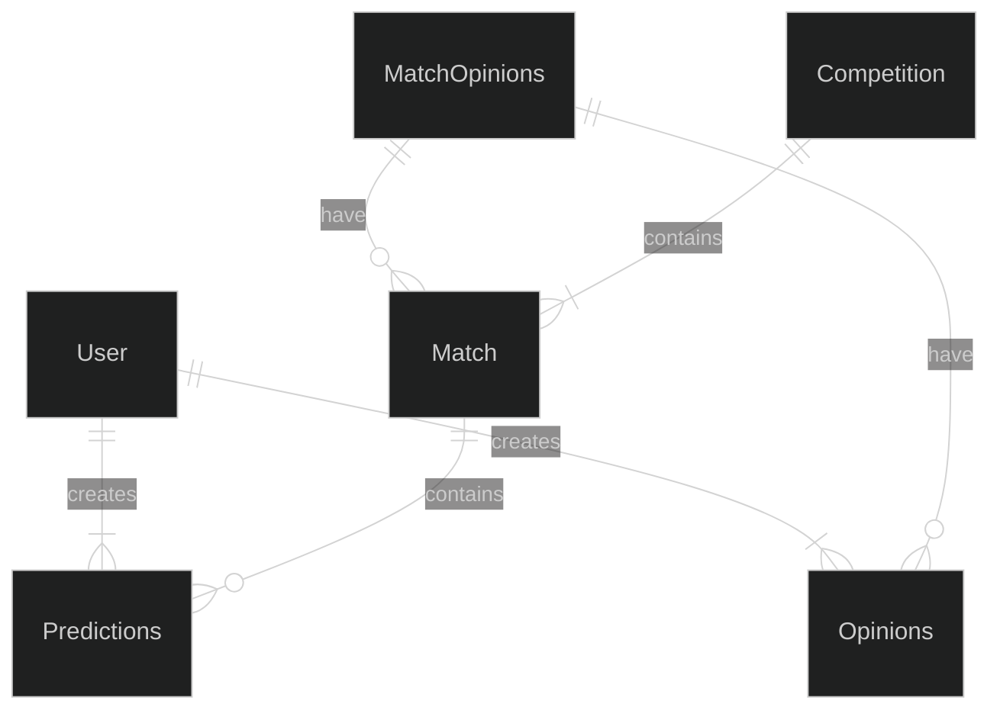

# Real Madrid Opinions Tracker

## Overview
This app tracks fans' opinions and reviews of soccer matches of the famous soccer team Real Madrid.

After the stunning and humiliating defeat of Real Madrid in the Champions League semi-finals (But knowing that Manchester City was the best team in the entire match). I wanted to keep track of all the opinions and reviews of the 23/24 season and try to predict the results of future games.

## Priorities
### Must Haves
- A user must be able to log in.
- A user must be able to see match info (teams, time & date, stadium, competition, and available players).
- A user must be able to add their match result prediction.
- A user must be able to add a review or opinion after the match finishes.

### Should Have
- A user should be able to add their match result prediction in the form of points (e.g., 2-1, 0-0, etc).
- A user should be able to read other users opinions and predictions.
- A user should be able to a public or private opinion about a match.

### Could Have
- A user could be able to add their match result prediction in the form of percentages (e.g., Real Madrid has 45% of winning, 10% of a draw, ad 45% of losing)
- A user could be able to rank and point Real Madrid players who played in the match.

### Will not Have
- A user will not be able to see other matches unrelated to Real Madrid.

### Domain Model Diagram

